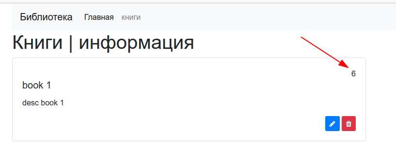

# Домашние задания по курсу «NDSE - Настройка окружения Node.js и библиотека Express.js

## Блок 2: Библиотека Express.js

Домашнее задание к занятию «2.5 Docker, контейнеризация приложения»

ТЗ доступно по [ссылке](https://github.com/netology-code/ndse-homeworks/tree/master/009-docker-2).

Запуск: `docker-compose up -d`.

Счетчик отображается при просмотре книги: 

